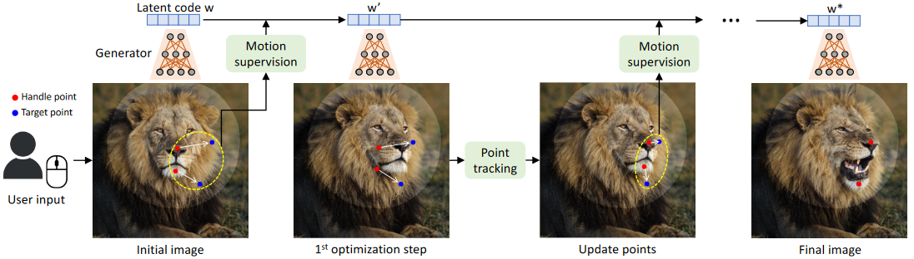
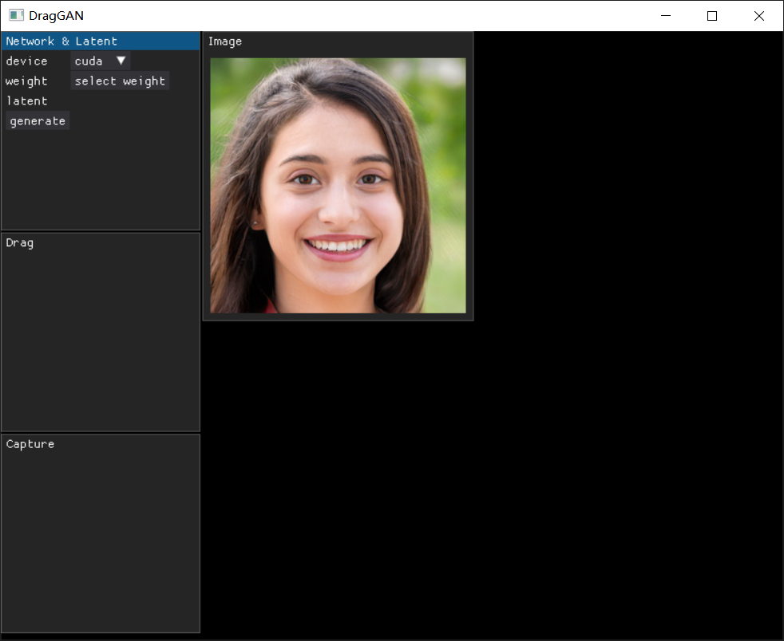

# DragGAN - WIP
Implementation of [DragGAN: Interactive Point-based Manipulation on the Generative Image Manifold](https://arxiv.org/abs/2305.10973).

```shell
# gui
pip install dearpygui
# run demo
python gui.py
```



# TODO
- [x] GUI
- [ ] drag it - in coming today or tomorrow
- [ ] load real image
- [ ] mask

# StyleGAN2 Pre-Trained Model
Rosinality's pre-trained model(256px) on FFHQ 550k iterations \[[Link](https://drive.google.com/open?id=1PQutd-JboOCOZqmd95XWxWrO8gGEvRcO)\].

# References
- https://github.com/rosinality/stylegan2-pytorch
