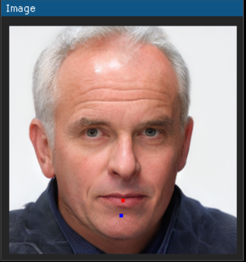
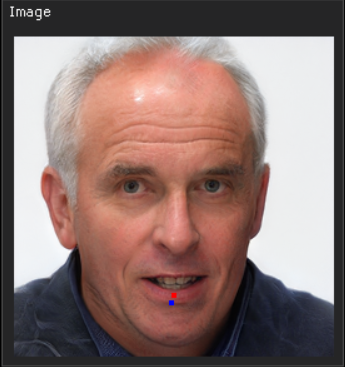
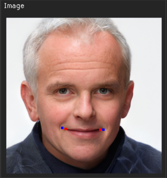

# DragGAN
Implementation of [DragGAN: Interactive Point-based Manipulation on the Generative Image Manifold](https://arxiv.org/abs/2305.10973).
## Install
This application uses python2, if you don't have it please install. 
Also this application require PyTorch and NumPy, you can install them with further commands:
```shell 
pip install numpy
```
*and*
```shell
pip install pytorch
```
*Install GUI library*
```shell
pip install dearpygui
```
Run Test program
```shell
python gui.py
```
If you have any errors check *requirements.txt* with all versions of required packages




# TODO
- [x] GUI
- [x] drag it
- [ ] load real image
- [ ] mask

# StyleGAN2 Pre-Trained Model
Rosinality's pre-trained model(256px) on FFHQ 550k iterations \[[Link](https://drive.google.com/open?id=1PQutd-JboOCOZqmd95XWxWrO8gGEvRcO)\].

# References
- https://github.com/rosinality/stylegan2-pytorch
